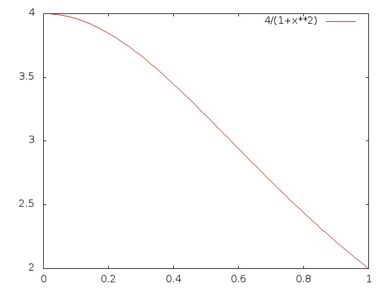
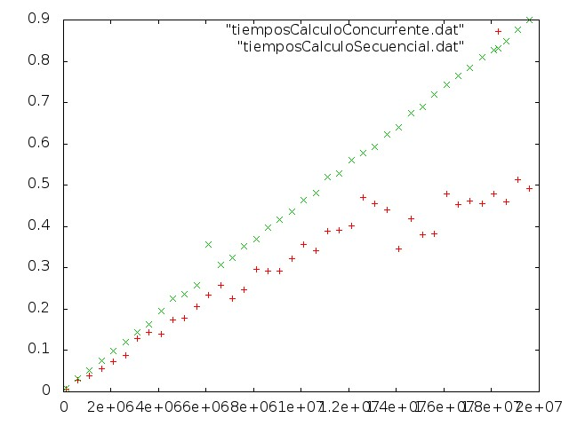

#Interpretación Geométrica

##**Seminario 1** 
Aplicación de concurrencia con el uso de hebras POSIX

### Introducción
Vamos a realizar la aproximación de la integral de la función 4/1+x² entre 0 y 1, es decir el número pi. Para ello desarrollamos la versión secuencial del programa para después compararla con la versión concurrente para dos procesadores y veremos que diferencias hay entre los tiempos que obtengamos como resultado.

La sección de la cual vamos a calcular su area mediante aproximación es que se puede ver en la siguiente gráfica:




### Desarrollo

En un primer momento disponíamos del código calculoConcurrente.cpp para la ejecución de la aproximación de la integral para saber el area de la función mediante un muestreo que el usuario indica en su ejecución, pero en este caso hemos reeditado el código haciéndolo más compresible (subjetivamente) aunque menos compacto (para ver bien como se aproxima mediante los rectángulos que se van creando y el cálculo de su area el total del area bajo la gráfica(integral)). Dicho código es calculoSecuencialVersionSimple.cpp.

Después de tener claro como procede la integración se construye la versión concurrente del mismo que aprovecha la concurrencia que la operación ofrece, ya que como se ve en el código calculoConcurrente.cpp se puede dividir la operación en el número de hebras que queramos (en nuestro caso dos por tener un Intel Core Duo) siempre que el número de muestras sea multiplo del número de hebras.

En esta versión se ha optado por dividir la grafica en dos y encargar a cada una de las hebras el procesamiento de las muestras, pero también se podría haber intercalado esta asignación de modo que la hebra 1 se encargara de las muestras impares y la hebra 2 de las partes, es otra opción igualmente válida pues los tiempos que se arrojarían serían muy similares, al final estaríamos cargando de igual forma ambos procesadores.

Una vez construidos ambos códigos los compilamos y ejecutamos, pasamos los datos resultantes a unos ficheros .dat y con estos construimos la gráfica para corroborar de forma visual el resultado que esperámos, **la ejecución concurrente** en los dos procesadores **reduce el tiempo de ejecución**.

El resultado es el siguiente para un muestreo de 100.000 a 20.000.000 de muestras.




Para facilitar el trabajo se ha creado un fichero Bash, ejecutarComparativa.sh que realiza todo el proceso, desde compilar los cpp fuentes, obtener los datos de la ejecución en bucle y crear una gráfica como la que vemos. Solo es necesario ejecutar dicho .sh .

Para probar con cualquier modificación sólo es necesario acceder y modificar lo necesario en los ficheros.

Nota: El número de muestras puede subirse tanto como se quiera pero dependerá de la potencia de nuestro sistema (sobre todo de la CPU) el tiempo que pueda llegar a tardar la ejecución. Por otra parte se ha detectado que las funciones que calculan el tiempo fallan a partir de los 30.000.000 de muestras, parece ser que por un problema de la arquitectura, que parece no afectar a las de 64bits pero si a las de 32bits como la máquina en la que se ha realizado este trabajo.


Detalles de las gráficas:

La primera gráfica ha sido creada con gnuplot así:
```sh
Ubuntu> gnuplot
gnuplot> set terminal jpeg
gnuplot> set output graficaFuncion.jpeg
gnuplot> plot [0:1] 4/(1+x**2)
gnuplot> exit
``` 
Para ver como se ha creado la segunda ver el script creacionGrafica.gp que es pasado a gnuplot directamente asi:
```sh
Ubuntu> gnuplot creacionGrafica.gp
```